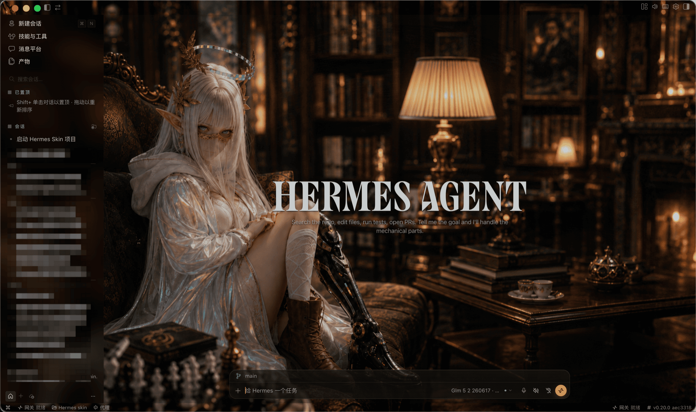
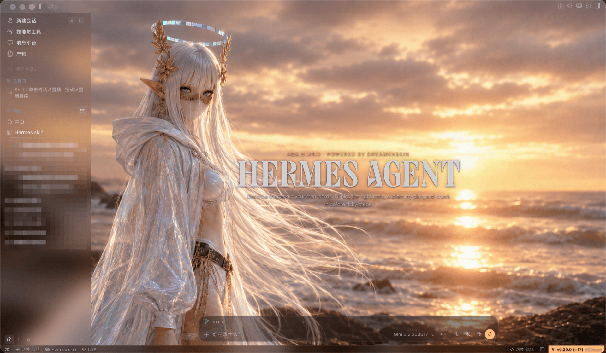

# dream0xskin-Hermes

> Custom visual skins for [Hermes Agent](https://hermes-agent.nousresearch.com/) Desktop (Electron-based) on macOS.
> Injects custom CSS and background artwork via Chrome DevTools Protocol — **no modification to the app itself**, no touching `app.asar`, no breaking code signatures.

> 为 [Hermes Agent](https://hermes-agent.nousresearch.com/) 桌面版（基于 Electron）定制的视觉皮肤系统，运行于 macOS。
> 通过 Chrome DevTools Protocol 注入自定义 CSS 和背景图——**不修改应用本身**，不碰 `app.asar`，不破坏代码签名。



> The character **Ada** - a high elf with a cybernetic leg, seated in an opulent baroque library, rendered in warm gold and deep shadow. The default theme that ships with dream0xskin-Hermes.
>
> 角色形象 **Ada** - 一位装有赛博机械义肢的高等精灵，端坐于华丽的巴洛克书房中，以暖金与深沉阴影呈现。dream0xskin-Hermes 的默认主题。



> **Aura Stand** - the same high elf standing on coastal rocks at golden hour, holographic halo shimmering above, iridescent robes catching the sunset. A user-created theme showing the immersive frosted-glass effect over a vivid landscape.
>
> **Aura Stand** - 同一位高等精灵在黄金时刻立于海岸礁石之上，幻彩圣光环悬浮于头顶，镭射长袍映照夕阳余晖。用户自定义主题，展示沉浸式毛玻璃效果与生动风景背景的融合。

---

## ✨ Features / 功能特性

- **Art Analysis Engine** — extracts a coherent color palette from any background image automatically / 从任意背景图自动提取协调的调色板
- **RGB variable system** — fine-grained `--hs-*` RGB variables for background, text, accent, and line colors / 细粒度 `--hs-*` RGB 变量系统，控制背景、文字、强调色和线条色
- **Scrim gradient layers** — multi-stop gradient overlays ensure text legibility over any artwork / 多段渐变遮罩层，确保任意背景图上的文字可读性
- **Immersive frosted glass** — sidebar, composer, and reading cards use `backdrop-filter` blur with tunable opacity / 沉浸式毛玻璃——侧边栏、输入框、阅读卡片使用可调透明度的 `backdrop-filter` 模糊
- **Menu bar launcher** (native Swift) — toggle skin, switch themes, with stop-and-wait race-condition handling / 菜单栏启动器（原生 Swift）——切换皮肤/主题，带停止等待防竞态
- **Live injection** — apply skins without restarting Hermes / 实时注入——无需重启 Hermes 即可应用皮肤
- **Status bar aware** — frosts the bottom status bar so Gateway/Cron/Session info stays legible / 状态栏感知——为底部状态栏添加毛玻璃，确保 Gateway/Cron/Session 信息可读
- **Zero footprint** — nothing is patched in the Hermes app bundle / 零侵入——不修改 Hermes 应用本体

## 🎨 Built-in Theme / 内置主题

| Theme | Character | Description | Palette |
|---|---|---|---|
| Ada Sofa | **Ada** - a high elf with a cybernetic leg in a baroque library / 装有赛博义肢的高等精灵，巴洛克书房 | Warm dark + gold / 暖暗 + 金 | `#080706` / `#ec963d` |
| Ada Stand | **Ada** - standing on coastal rocks at golden hour / 黄金时刻立于海岸礁石 | Warm sunset + amber / 暖夕阳 + 琥珀 | `#1a120e` / `#fdb874` |

> Create your own themes by adding a new directory under `runtime/themes-hermes/` with a `theme.json` and a background image.
>
> 在 `runtime/themes-hermes/` 下新建目录，放入 `theme.json` 和背景图即可创建自定义主题。

## 🚀 Installation / 安装

### Prerequisites / 前置要求

- macOS 13.0+
- [Hermes Agent](https://hermes-agent.nousresearch.com/) Desktop installed and launched at least once / 已安装并至少启动过一次
- Swift toolchain (bundled with Xcode Command Line Tools) / Swift 工具链（随 Xcode Command Line Tools 附带）
- Python 3.9+ with `websockets` library / Python 3.9+ 及 `websockets` 库
  ```bash
  pip3 install websockets
  ```

### Build & Install / 构建并安装

```bash
git clone https://github.com/white0xted/dream0xskin-Hermes.git
cd dream0xskin-Hermes

# Build the launcher and install / 构建启动器并安装
./scripts/install-launcher-macos.sh
```

This will / 此操作将：
1. Build the Swift menu bar launcher to `dist/` / 构建 Swift 菜单栏启动器
2. Install the app to `/Applications/Hermes Skin.app` / 安装到 `/Applications/`
3. The launcher copies runtime assets (CSS, injector, themes) into the app bundle / 启动器将运行时资源（CSS、注入器、主题）复制到 App 内

### Usage / 使用

1. Launch **Hermes Skin** from Spotlight or `/Applications` / 从 Spotlight 或 `/Applications` 启动
2. Click the 🎨 paintpalette icon in the menu bar / 点击菜单栏中的 🎨 调色板图标
3. Choose **"启动并连接 Hermes"** (Launch & Connect Hermes) / 选择「启动并连接 Hermes」
4. Select a theme from the **"切换皮肤"** (Switch Skin) submenu / 从「切换皮肤」子菜单中选择主题
5. The skin applies instantly — no restart needed / 皮肤即时生效，无需重启

### Manual Injection (without launcher) / 手动注入（不用启动器）

```bash
# 1. Launch Hermes with CDP debugging port / 以调试端口启动 Hermes
/Applications/Hermes.app/Contents/MacOS/Hermes \
  --remote-debugging-port=9334 \
  --user-data-dir=/tmp/hermes-skin-cdp

# 2. Inject skin / 注入皮肤
python3 runtime/injector-hermes.py \
  --port 9334 \
  --theme-dir runtime/themes-hermes/ada-sofa

# 3. Watch mode (auto-reinject on SPA navigation) / 监视模式（SPA 导航后自动重注入）
python3 runtime/injector-hermes.py \
  --port 9334 \
  --theme-dir runtime/themes-hermes/ada-sofa \
  --watch

# 4. Remove skin / 移除皮肤
python3 runtime/injector-hermes.py --port 9334 --remove
```

## 🏗️ Architecture / 架构

```
dream0xskin-Hermes/
├── runtime/                          # CDP injection engine / CDP 注入引擎
│   ├── injector-hermes.py            # Python CDP injector with --watch mode (port 9334)
│   ├── hermes-skin.css               # Skin CSS (--theme-* + --hs-* variable overrides)
│   ├── selectors-hermes.json         # DOM selector contract (24 data-slot values)
│   └── themes-hermes/<theme-id>/     # Each theme: theme.json + background image
│       ├── ada-sofa/
│       │   ├── theme.json            # Colors, art metadata, safe-area config
│       │   └── ada-sofa.png          # Background artwork
│       └── ada-stand/
│           ├── theme.json            # Colors, art metadata, safe-area config
│           └── ada-stand.png         # Background artwork
├── launcher/                          # Swift menu bar app / Swift 菜单栏应用
│   ├── Sources/HermesSkinLauncher/main.swift
│   ├── Package.swift
│   ├── build-launcher-app.sh
│   ├── Info.plist
│   └── Assets/                        # App icon, menu bar icons / 应用图标、菜单栏图标
├── scripts/                           # Shell scripts / Shell 脚本
│   ├── install-launcher-macos.sh      # Build & install / 构建并安装
│   ├── stop-skin-macos.sh             # Stop injection / 停止注入
│   └── doctor-macos.sh                # Diagnostics / 诊断
├── docs/
│   ├── demo.png                       # Screenshot - Ada Sofa theme / 截图 - Ada Sofa 主题
│   └── demo-aura-stand.png            # Screenshot - Aura Stand theme / 截图 - Aura Stand 主题
├── HANDOFF.md                         # Technical documentation / 技术文档
└── LICENSE                            # MIT
```

### How It Works / 工作原理

1. The Swift launcher starts Hermes with `--remote-debugging-port=9334` / Swift 启动器以调试端口启动 Hermes
2. `injector-hermes.py` connects to the CDP WebSocket endpoint and injects CSS + theme configuration / Python 注入器连接 CDP WebSocket 并注入 CSS 和主题配置
3. `Page.addScriptToEvaluateOnNewDocument` ensures skins persist across SPA navigations / 确保皮肤在 SPA 导航后持久生效
4. A `MutationObserver` re-applies the background overlay if Hermes re-renders the DOM / 如果 Hermes 重新渲染 DOM，MutationObserver 会重新应用背景层
5. The `hermes-skin-active` class on `<html>` activates all skin CSS rules / `<html>` 上的 class 激活所有皮肤 CSS 规则

### Art Analysis Engine / Art Analysis 引擎

The injector reads `theme.json` and maps colors to a two-layer system:

1. **Hermes native layer** — overrides `--theme-*` CSS variables (sidebar-seed, card-seed, mix percentages → transparent) to let the background art show through
2. **Skin layer** — defines `--hs-*` RGB variables (bg, text, accent, line) used by custom CSS rules for frosted glass panels, scrim gradients, and text shadows

注入器读取 `theme.json`，将颜色映射到双层系统：

1. **Hermes 原生层** — 覆盖 `--theme-*` CSS 变量（sidebar-seed、card-seed、mix 百分比 → 透明），让背景图透出
2. **皮肤层** — 定义 `--hs-*` RGB 变量（bg、text、accent、line），由自定义 CSS 规则用于毛玻璃面板、渐变遮罩和文字阴影

## 📖 Documentation / 文档

See [HANDOFF.md](HANDOFF.md) for detailed architecture, deployment paths, and debugging commands.

详见 [HANDOFF.md](HANDOFF.md)——包含完整架构说明、部署路径和调试命令。

## 🐛 Troubleshooting / 故障排除

### Skin not appearing / 皮肤未生效

1. Ensure Hermes was launched with `--remote-debugging-port=9334` / 确保以调试端口启动
2. Check `python3 runtime/injector-hermes.py --port 9334 --probe-only` / 运行探测确认 CDP 连通
3. Verify `hermes-skin-active` class is on `<html>`: `document.documentElement.className` in DevTools / 在 DevTools 中检查 `<html>` 上是否有 `hermes-skin-active` class

### Status bar text invisible / 状态栏文字不可见

The bottom status bar (`[data-slot="statusbar"]`) inherits `--ui-sidebar-surface-background` which we make transparent. The skin CSS adds its own frosted glass background to fix this. If it's still invisible, ensure you're on the latest CSS version.

底部状态栏继承 `--ui-sidebar-surface-background`（我们设为透明）。皮肤 CSS 为其添加了独立的毛玻璃背景来修复此问题。如果仍不可见，请确保使用最新版 CSS。

### Multiple Hermes windows / 多个 Hermes 窗口

Hermes allows multiple processes. The injector connects to the first CDP target. If you have multiple windows, use `--probe-only` to list targets and verify you're injecting into the right one.

Hermes 允许多进程。注入器连接第一个 CDP 目标。如有多个窗口，用 `--probe-only` 列出目标确认注入正确的窗口。

## 🙏 Acknowledgments / 致谢

This project is adapted from [**dream0xskin**](https://github.com/white0xted/dream0xskin) — the Codex skin project. The Art Analysis Engine concept, RGB variable system, scrim layer architecture, and overall design philosophy all originate from that project.

本项目改编自 [**dream0xskin**](https://github.com/white0xted/dream0xskin) — Codex 皮肤项目。Art Analysis 引擎概念、RGB 变量系统、Scrim 遮罩层架构及整体设计哲学均源自该项目。

- [dream0xskin](https://github.com/white0xted/dream0xskin) — Codex skin, the foundation of this project / Codex 皮肤，本项目的基础
- [Hermes Agent](https://github.com/NousResearch/hermes-agent) — The desktop app being skinned / 被定制皮肤的桌面应用

## 📄 License / 许可证

MIT
